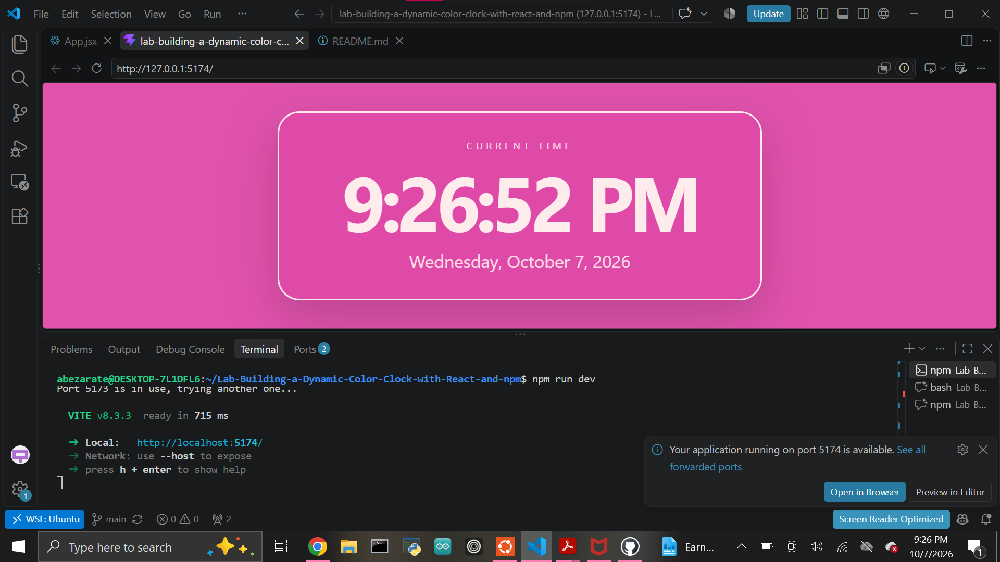

# Dynamic Color Clock

A React application that displays the current date and time and changes its colors dynamically throughout the day.

## Technologies Used

- React
- Vite
- JavaScript
- date-fns
- CSS

## How to Run the Project

1. Clone the repository.
2. Open the project folder in a terminal.
3. Install the dependencies:

```bash
npm install
```
4. Start the development server:

```bash
npm run dev
```

5. Open the local URL shown in the terminal in your browser.

## Screenshot

